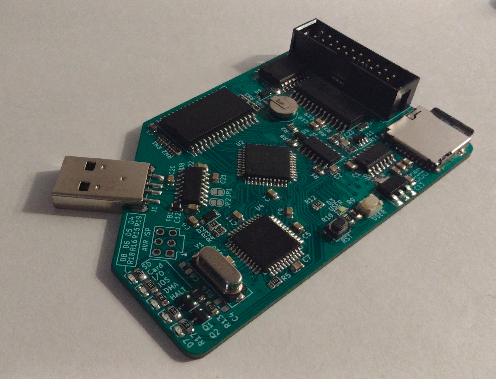

# Z80-Card



This repository contains Schematics, KiCad design files and software for Z80 Single Board Computer that fits in ID-1 card dimensions.
It's SMD version of a very popular Z80-MBC2 project with all addons (I2C I/O expander, SD Card, RTC, USB-UART) built-in.
Fully compatible with IOS firmware written for ATMega32 used on Z80-MBC2. Assembly does not involve components smaller than 0805 SMD passives and ICs smaller than SOT-23-5. 

Production files (Bill of Materials, PDF Schematic, gerbers) can be found in [production-files](production-files/Rev-1.1) folder. 

# Notes
To be able to use USB to change IOS versions, external AVR-ISP programmer (USBAsp, PICKIT 2, etc.) must be used to flash OptiBoot bootloader. Commands for flashing hex with IOS and bootloader and setting the fuses:

```
avrdude -p m32 -c pickit2 -D -U flash:w:software/Z80-MBC2/S220718-R240620_IOS-Z80-MBC2.ino.with_bootloader_atmega32_16000000L.hex
avrdude -p m32 -c pickit2 -D -U lfuse:w:0xAF:m -U hfuse:w:0xD6:m -U efuse:w:0xCF:m
```

# License
GPLv3 (Same as Z80-MBC2 project)
